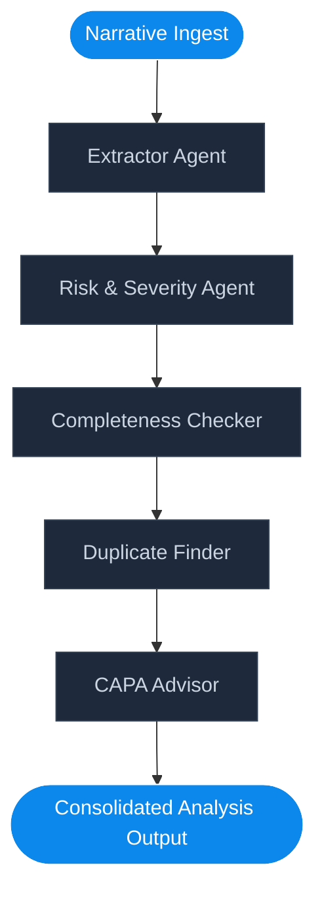

# AI-Powered Customer Complaint Management System
> **An Intelligent GMP Intake & Risk Compliance Automation Platform for Pharmaceutical Manufacturing**

This repository contains the source code for the **AI-Powered Customer Complaint Management System**, a full-stack enterprise platform built for pharmaceutical quality assurance (QA) teams. It automates GxP (Good Practice) complaint intake, extracts batch parameters, conducts risk assessment, flags duplicates, analyzes root causes, and suggests Corrective and Preventive Actions (CAPA).

Powered by a modular **LangGraph** multi-agent state-machine utilizing **Gemma2-9B-IT** on the **Groq API**.

---

## 📖 Table of Contents
- [Overview](#-overview)
- [Features](#-features)
- [Technology Stack](#-technology-stack)
- [Project Architecture](#-project-architecture)
- [AI Workflow (LangGraph)](#-ai-workflow-langgraph)
- [Folder Structure](#-folder-structure)
- [API Endpoints](#-api-endpoints)
- [Environment Variables](#-environment-variables)
- [Installation & Setup](#-installation--setup)
- [Future Scope](#-future-scope)
- [License](#-license)

---

## 🌟 Overview
In pharmaceutical manufacturing, customer complaints (e.g., inefficacy, contamination, packaging defects) must be logged, investigated, and archived under strict international compliance standards (such as FDA 21 CFR Part 211.198).

This application processes raw inputs (e.g., patient emails, partner portal logs) or uploaded files (PDF, DOCX, TXT) and orchestrates a set of cooperative AI agents. The agents auto-populate QMS intake forms, identify batch correlation to past events, assess clinical safety hazards, and recommend investigation paths.

---

## 🛠️ Features

### 1. Unified QMS Intake Dashboard
- Real-time KPIs showing active complaints, critical escalations, completeness index, and active batch holds.
- Interactive distribution charts showing severity classifications and workflow states.
- Automated alert triggers for immediate containment of critical batch defects.

### 2. Document Parser & Auto-Fill Form
- Drag-and-drop file upload supporting PDF, DOCX, and TXT.
- Extractor Agent parses details: Customer, Product Name, Batch/Lot, Mfg/Exp dates, Defect class, and Severity.
- Highlights missing metadata with actionable alerts to ensure 21 CFR data integrity.

### 3. GxP Compliance Risk Assessment
- Classifies clinical safety risks (patient health impact) and regulatory non-compliance liabilities (recalls, FDA 483 warnings).
- Formulates professional risk justifications citing GMP guidelines.

### 4. Recurrent Batch & Duplicate Detection
- Scans database records to calculate statistical similarity indexes for matching products or batch numbers.
- Alerts QA analysts to systemic line errors or contamination campaigns.

### 5. Automated RCA & CAPA Generator
- Formulates potential mechanical, chemical, or operational Root Cause Analyses (RCA).
- Generates corrective containment actions and long-term preventive procedures.

### 6. Interactive QA Chat Copilot
- Conversation window contextualized specifically on the loaded case file.
- Drafts regulatory emails, checks BMR (Batch Manufacturing Record) parameters, and suggests standard operating procedures (SOPs).

---

## 💻 Technology Stack

### Backend
- **Python FastAPI**: High-performance, asynchronous web server framework.
- **SQLAlchemy ORM**: Flexible SQL query generation mapping.
- **SQLite / PostgreSQL**: Pre-configured SQLite local fallback, production-ready for PostgreSQL.
- **PyPDF & Python-Docx**: Document text extraction engines.

### Frontend
- **React 19**: Modern declarative UI framework.
- **Redux Toolkit**: Centralized store management for pipeline analysis staging and conversational memory.
- **React Router v7**: Declarative client-side routing.
- **Tailwind CSS v4 & PostCSS**: Customized clinical theme styling with responsive utilities.
- **Lucide Icons**: Premium vector interface symbols.

### Artificial Intelligence
- **LangGraph**: Stateful multi-agent workflow framework.
- **LangChain Core**: LLM integrations.
- **Groq API (Gemma2-9B-IT)**: Ultra-low latency inference engine.

---

## 🏗️ Project Architecture

```
                                  +---------------------------------------+
                                  |         React Frontend Client         |
                                  |           (Vite / Redux / Tailwind)   |
                                  +-------------------+---------------+---+
                                                      |               ^
                                         REST API     |               |  API
                                         Requests     v               |  Responses
                                  +-------------------+---------------+---+
                                  |             FastAPI Backend           |
                                  |          (SQLAlchemy Database Layer)  |
                                  +-------+-----------------------+-------+
                                          |                       |
                                          v Query / Update        v Invoke Workflow
                                  +-------+-------+       +-------+-------+
                                  |   Database    |       |   LangGraph   |
                                  |  PostgreSQL / |       |  Orchestrator |
                                  |    SQLite     |       +-------+-------+
                                  +---------------+               |
                                                                  v Collaborative Agent Nodes
                                                          [ Extractor Node ]
                                                                  |
                                                          [ Risk Assessor Node ]
                                                                  |
                                                          [ Completeness Checker ]
                                                                  |
                                                          [ Duplicate Finder ]
                                                                  |
                                                          [ CAPA Advisor Node ]
                                                                  |
                                                                  v Outputs Consolidated
```

---

## 🤖 AI Workflow (LangGraph)

The state-machine pipeline routes complaint text through five specialized collaborative agent nodes:



1. **Extractor Agent (`extractor.py`)**: Runs precise line scanning and JSON prompts to parse key metadata (Product, Batch, Mfg/Exp Dates, customer details).
2. **Risk Assessor (`risk_assessment.py`)**: Checks safety profiles and GMP impact, quoting 21 CFR regulations.
3. **Completeness Checker (`completeness_checker.py`)**: Scores fields mathematically and outlines follow-up recommendations.
4. **Duplicate Finder (`duplicate_detector.py`)**: Queries database records to list batch conflicts and calculate similarity indexes.
5. **CAPA Advisor (`root_cause_capa.py`)**: Drafts immediate containment instructions and preventive plant controls.

---

## 📂 Folder Structure

```text
pharma-complaint-system/
├── backend/
│   ├── app/
│   │   ├── agents/                  # LangGraph Modular Agents
│   │   │   ├── completeness_checker.py # Data integrity scoring
│   │   │   ├── copilot.py           # Conversational context agent
│   │   │   ├── duplicate_detector.py # Database matching query
│   │   │   ├── extractor.py         # Entity extraction node
│   │   │   ├── graph.py             # Graph state-machine builder
│   │   │   ├── risk_assessment.py   # Clinical severity assessor
│   │   │   ├── root_cause_capa.py   # RCA & CAPA writer
│   │   │   └── state.py             # LangGraph state schema
│   │   ├── utils/
│   │   │   └── document_parser.py   # File ingestion (PDF, DOCX, TXT)
│   │   ├── config.py                # Environment configurations
│   │   ├── crud.py                  # Database queries
│   │   ├── db.py                    # Database connection
│   │   ├── main.py                  # API endpoints and validations
│   │   ├── models.py                # Database schemas
│   │   └── schemas.py               # Pydantic schemas
│   ├── requirements.txt             # Python packages
│   └── .env.example                 # Example settings
├── frontend/
│   ├── src/
│   │   ├── components/
│   │   │   └── Layout.jsx           # Sidebar and main frame
│   │   ├── pages/
│   │   │   ├── AICopilot.jsx        # Conversational console
│   │   │   ├── ComplaintDetails.jsx # Tabbed QA investigation
│   │   │   ├── ComplaintHistory.jsx # Searchable datatable
│   │   │   ├── Dashboard.jsx        # Metrics and charts
│   │   │   └── LogComplaint.jsx     # Wizard logging file intake
│   │   ├── store/
│   │   │   ├── complaintSlice.js    # Redux async thunks
│   │   │   └── index.js             # Store configureStore
│   │   ├── App.jsx                  # Route definitions
│   │   └── main.jsx                 # Provider bootstrapper
│   ├── package.json                 # Node dependencies
│   ├── tailwind.config.js
│   ├── postcss.config.js
│   └── index.html
├── LICENSE                          # MIT License
└── .gitignore                       # Clean Git Ignore
```

---

## 📡 API Endpoints

### Dashboard Stats
- **`GET /api/dashboard/stats`**: Returns calculated QMS KPIs, statuses, and recent activities.

### Complaint Intake & AI Pipeline
- **`POST /api/complaints/analyze-text`**: Runs LangGraph on past narratives.
- **`POST /api/complaints/upload-doc`**: Uploads PDF, DOCX, or TXT and triggers LangGraph extraction.
- **`POST /api/complaints/submit`**: Saves validated QMS complaint files to SQLite.

### Complaints Register & History
- **`GET /api/complaints/history`**: Lists files with optional search and filters.
- **`GET /api/complaints/{id}`**: Returns detail fields, risk logs, duplicate lists.
- **`PUT /api/complaints/{id}`**: Updates resolution states.
- **`DELETE /api/complaints/{id}`**: Removes case from the registry.

### QA Copilot Chat
- **`GET /api/complaints/{id}/copilot`**: Retrieves conversation registers.
- **`POST /api/complaints/{id}/copilot`**: Sends queries to the Copilot.

---

## 🔑 Environment Variables
Configure the `.env` settings inside the `backend/` directory:

| Variable | Description | Default Value |
| :--- | :--- | :--- |
| `DATABASE_URL` | SQLAlchemy connection string | `sqlite:///./complaints.db` |
| `GROQ_API_KEY` | Groq API Key | `(Optional - runs mock fallback if blank)` |
| `HOST` | Backend host bind | `127.0.0.1` |
| `PORT` | Backend port bind | `8000` |

---

## 🔌 Installation & Setup

### 1. Backend Inception
```bash
cd backend
python -m venv venv

# Activate Virtual Environment
# Windows
.\venv\Scripts\Activate.ps1
# macOS/Linux
source venv/bin/activate

# Install dependencies
pip install -r requirements.txt

# Run server
python -m app.main
```

### 2. Frontend Boot
```bash
cd frontend
npm install
npm run dev
```

Open `http://localhost:5173/` in your browser.

---

## 🔮 Future Scope
- **OCR Integration**: Direct optical character recognition for scanned handwritten hospital forms.
- **EHR Integration**: Interfacing with hospital Electronic Health Records (EHR) to automate patient demographics verification.
- **FDA E-Submission Support**: Auto-filling FDA MedWatch 3500A forms for XML direct submission.

---

## 📄 License
This project is licensed under the MIT License - see the [LICENSE](LICENSE) file for details.
