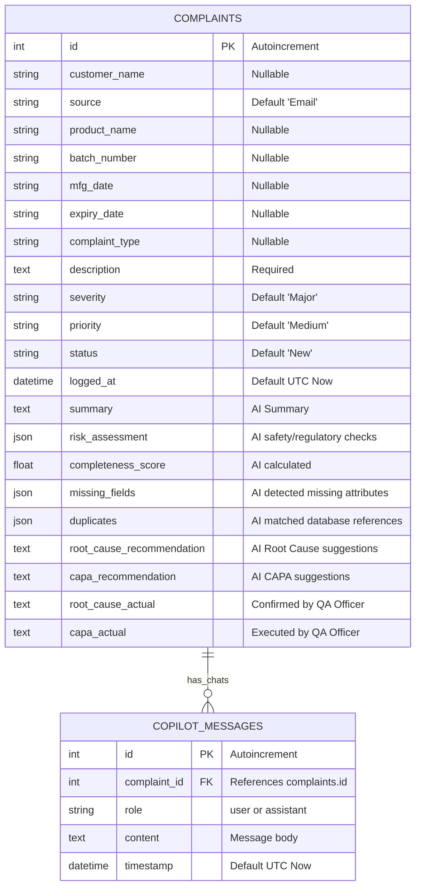

# Pharma QMS AI Hub - Technical Documentation

This document provides in-depth technical documentation for the **AI-Powered Customer Complaint Management System** designed for the pharmaceutical manufacturing industry.

---

## 1. System Architecture & Folder Structure

The project is structured as a full-stack decoupled application containing a Python FastAPI backend and a React SPA frontend:

```text
pharma-complaint-system/
├── backend/
│   ├── app/
│   │   ├── agents/                  # Stateful Multi-Agent nodes (LangGraph)
│   │   │   ├── completeness_checker.py # Review data gaps and compute score
│   │   │   ├── copilot.py           # QA Advisor Copilot chatbot
│   │   │   ├── duplicate_detector.py # Queries SQLite to identify duplicate batches
│   │   │   ├── extractor.py         # Regular expression-driven extraction
│   │   │   ├── graph.py             # LangGraph state machine compiler
│   │   │   ├── risk_assessment.py   # GCP/GMP safety severity assessor
│   │   │   ├── root_cause_capa.py   # RCA and CAPA recommendations writer
│   │   │   └── state.py             # State definition dictionary
│   │   ├── utils/
│   │   │   └── document_parser.py   # File stream parser (PDF, DOCX, TXT)
│   │   ├── config.py                # Environment configs & settings
│   │   ├── crud.py                  # Database CRUD queries
│   │   ├── db.py                    # SQLite engine and session configuration
│   │   ├── main.py                  # API routes, CORS setup, and validations
│   │   ├── models.py                # Database models
│   │   └── schemas.py               # Pydantic schemas
│   ├── requirements.txt             # Python packages
│   └── .env.example                 # Example configuration
└── frontend/
    ├── src/
    │   ├── components/
    │   │   └── Layout.jsx           # Layout sidebar & header wrapper
    │   ├── pages/
    │   │   ├── AICopilot.jsx        # Conversational QA console
    │   │   ├── ComplaintDetails.jsx # Detailed tabbed view & resolution portal
    │   │   ├── ComplaintHistory.jsx # Searchable & filtered records table
    │   │   ├── Dashboard.jsx        # High-level KPIs & bar distributions
    │   │   └── LogComplaint.jsx     # Wizard logging file intake & auto-fill
    │   ├── store/
    │   │   ├── complaintSlice.js    # Redux async thunks and actions
    │   │   └── index.js             # Store configureStore
    │   ├── App.jsx                  # Main client-side router
    │   ├── index.css                # Tailwind CSS v4 directives & scrollbars
    │   └── main.jsx                 # Client boot context provider
```

---

## 2. Database Schema

The SQLite schema represents two relational tables mapping pharmaceutical complaints and contextual copilot chat messages.



---

## 3. LangGraph Workflow & AI Pipeline

The State Machine acts as an stateful pipeline where each node updates the `AgentState` before executing the next transition:

```text
  +-----------------------------------------------------------------------------------+
  |                                    AgentState                                     |
  |  - complaint_text: str                                                            |
  |  - extracted_data: dict          - risk_assessment: dict                          |
  |  - completeness_report: dict     - duplicates: list                               |
  |  - root_cause: str               - capa: str             - summary: str           |
  +-----------------------------------------------------------------------------------+
```

### Nodes Configuration:
1. **`extractor`**: Pulls entities out of the raw narrative. Includes date normalizer functions.
2. **`risk_assessor`**: Evaluates safety risks and FDA compliance triggers.
3. **`completeness_checker`**: Computes data completeness score.
4. **`duplicate_detector`**: Queries the database to list identical batch indices.
5. **`rc_capa_advisor`**: Formulates potential Root Causes and suggested containment and preventive controls.

---

## 4. Backend REST API Endpoints

All inputs and responses are serialized using Pydantic schemas.

### Verification Health
- **`GET /health`**
  - Response: `{"status": "healthy", "service": "pharma-complaint-api"}`

### QMS Dashboard Analytics
- **`GET /api/dashboard/stats`**
  - Computes counts, averages completeness index, returns recent activity logs.

### Analysis & Intake
- **`POST /api/complaints/analyze-text`**
  - Body: `{"description": "Complaint narrative text..."}`
  - Executes LangGraph state machine.
- **`POST /api/complaints/upload-doc`**
  - Body: `Multipart File Upload` (PDF, DOCX, TXT)
  - Extracts text first, then triggers LangGraph.
- **`POST /api/complaints/submit`**
  - Body: `ComplaintCreate` schema.
  - Runs database validation gates before saving.

### Cases Register
- **`GET /api/complaints/history`**
  - Parameters: `skip`, `limit`, `search`, `severity`, `priority`, `status`.
- **`GET /api/complaints/{id}`**: Returns full case record.
- **`PUT /api/complaints/{id}`**: Saves QA resolution overrides (actual root cause, CAPA, status updates).
- **`DELETE /api/complaints/{id}`**: Purges case log.

---

## 5. React Frontend Architecture

The client application is written in component-driven declarative React and Redux state store.

### Global State (`complaintSlice.js`):
- `complaints`: Active query results array.
- `selectedComplaint`: Detail case cache.
- `stats`: Centralized dashboard telemetry.
- `copilotMessages`: Memory list for chat window.
- `analyzedComplaint`: Wizard intake staging buffer.

### Page Viewports:
- **`Dashboard.jsx`**: High level KPIs with animated bar graphs representing status and severity partitions.
- **`LogComplaint.jsx`**: Input interface displaying interactive state changes as LangGraph transitions nodes.
- **`ComplaintDetails.jsx`**: Investigation center linking duplicate profiles, risk, CAPA forms, and contextual copilot chat.
